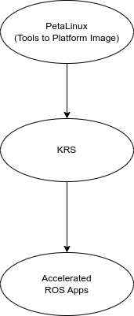

<style>
  :root {
    --color-highlight: #EE0000;
    --color-highlight-hover: #aaf;
    --color-highlight-heading: #EE0000;
    --color-header: #bbb;
    --color-header-shadow: transparent;
  }

  h2 {
    position: absolute;
    top: 30px;
    font-size: 1.5rem;
    /* left: 75px; */
    /* right: 75px; */
  }

  p {
  	/* text-align: left; */
  	text-align: middle;
  }
</style>

<!--  -->

# **KRS + KR260**

AMD Acceleration Platform

---

## Outline

- PetaLinux Tools
- KRS
- Accelerated ROS Apps

---

## Architecture



---

## Code Snippet

```sql
CREATE DATABASE joplin;
CREATE USER joplin WITH PASSWORD 'myPasswordHere';
GRANT ALL PRIVILEGES ON DATABASE joplin TO joplin;
```

```sh
$sudo ls -l
```

```js
console.log("hello world!");
```
